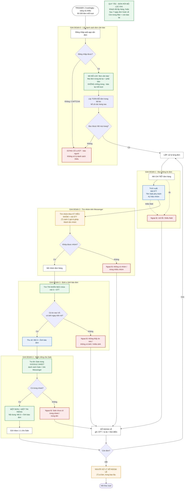
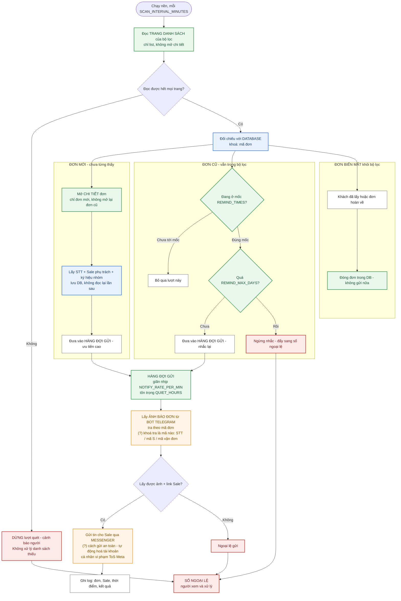

# Quy trình báo đơn — sơ đồ luồng

> **Phiên bản:** v1.1 · cập nhật 07/08/2026 — chốt 5/8 câu hỏi mở (xem §4)
> **Phạm vi:** nghiệp vụ Báo đơn. Xem `DVS-context-01-bao-don.md` cho bối cảnh nghiệp vụ,
> `711-scraper-context.md` cho spec kỹ thuật của bộ đọc dữ liệu.
> **Cảnh báo:** phần TO-BE dựa trên giả định về cấu trúc dashboard. Tại thời điểm viết,
> **team chưa có quyền truy cập dashboard**, nên chưa giả định nào được kiểm chứng.

---

## Chú giải màu

| Màu | Nghĩa |
|---|---|
| ⬜ Trắng | Hành động thông thường |
| 🟩 Xanh lá | Quy tắc nghiệp vụ — không được tự ý đổi khi code |
| 🟦 Xanh dương | Dữ liệu thu được |
| 🟧 Cam | **Chưa xác nhận** — cần người trả lời |
| 🟥 Đỏ | Nhánh ngoại lệ |

---

## 1. AS-IS — quy trình thủ công hiện tại

Đây là những gì nhân viên báo đơn đang làm bằng tay.

---

## 2. TO-BE — hệ thống tự động

Khác biệt cốt lõi so với AS-IS: **tách tần suất quét khỏi tần suất nhắn**, và **chỉ mở
trang chi tiết cho đơn mới** thay vì mở lại toàn bộ mỗi lượt.

---

## 3. Bảng cấu hình

Đặt trong `src/config.py` để scraper và backend dùng chung một nguồn.

| Biến | Mặc định | Nghĩa |
|---|---|---|
| `SCAN_INTERVAL_MINUTES` | `15` | Bao lâu quét dashboard một lần |
| `REMIND_TIMES` | `09:00,14:00` | Các mốc nhắc lại đơn cũ |
| `REMIND_MAX_DAYS` | `7` | Nhắc tối đa bao lâu |
| `QUIET_HOURS` | `21:00-07:00` | Không nhắn Sale trong khung này |
| `NOTIFY_RATE_PER_MIN` | `10` | Giãn nhịp gửi, tránh bị coi là spam |

Cấp áp dụng: **chung toàn hệ thống**, không cấu hình riêng theo Sale.

### Bốn quy tắc gửi

1. Đơn **lần đầu** vào bộ lọc → gửi ngay ở lượt quét kế tiếp
2. Đơn **đã báo**, còn trong bộ lọc → chỉ gửi lại ở mốc `REMIND_TIMES`
3. Đơn **rời bộ lọc** → đóng, ngừng gửi
4. Quá `REMIND_MAX_DAYS` → ngừng nhắc, đẩy sang sổ ngoại lệ

---

## 4. Đã xác nhận vs chưa xác nhận

### ✅ Đã xác nhận

- Gửi tin cho Sale qua **Messenger**; **ảnh báo đơn lưu tại bot Telegram**, tra theo mã đơn
  → mâu thuẫn Telegram/Messenger cũ đã gỡ: cả hai cùng tồn tại, mỗi bên một vai
- Tần suất báo hiện tại: **2 lượt/ngày — sáng và chiều** (không phải 4); mốc nhắc custom
  có thể thêm trong tương lai → giữ `REMIND_TIMES` dạng cấu hình
- `QUIET_HOURS` 21:00–07:00 **đúng với hiện tại**; tương lai có thể làm đêm → giữ dạng cấu hình
- Bộ lọc `đơn cần báo` tồn tại trên dashboard
- Tín hiệu cần báo = hàng **đã tới cửa hàng, khách chưa lấy** (mốc 4, không phải mốc 5)
- Đơn rời bộ lọc khi khách lấy hàng hoặc sau 7 ngày hoàn về
- Không chống trùng: còn trong bộ lọc thì còn báo lại
- Khối lượng: 50–200 đơn mỗi lượt
- `Sale phụ trách`, `STT`, `ký hiệu nhóm` nằm ở **trang chi tiết**, không phải trang danh sách
- Danh sách Sale + link Messenger nằm trong **Google Sheet**
- Đơn mới báo ngay; đơn cũ nhắc sáng + chiều; số lần cấu hình được, cấp toàn hệ thống

### 🟧 Chưa xác nhận

Đã chốt ngày 07/08/2026: câu 1 (ảnh lưu tại bot Telegram), câu 2 (bot có thật), câu 3
(kênh gửi là Messenger — cách gửi an toàn vẫn phải chọn, xem cảnh báo ToS ở sơ đồ TO-BE),
câu 7 (2 lượt/ngày sáng + chiều, mốc custom thêm sau), câu 8 (giữ 21:00–07:00, để dạng
cấu hình vì tương lai có thể làm đêm).

Còn mở 3 câu — người trả lời ban đầu **chưa hiểu câu hỏi**, nên dưới đây diễn giải lại
bằng lời thường:

| # | Câu hỏi (diễn giải lại) | Chặn cái gì |
|---|---|---|
| 4 | Tên các nhóm chat Messenger của đơn hàng được **đặt theo công thức nào**? Ví dụ nhóm tên là `S1234 - 15` hay `Nhóm 15 - STT 1234`? Cách trả lời dễ nhất: chụp màn hình tên của 2–3 nhóm thật. *(Lưu ý: nếu ảnh đã tra được từ bot Telegram thì bước tìm nhóm Messenger có thể bỏ hẳn — khi đó câu này hết quan trọng.)* | Giai đoạn 2 |
| 5 | Nhìn **trang danh sách** của bộ lọc (chưa bấm vào chi tiết): mỗi dòng đơn có hiển thị **một mã không bao giờ đổi** giữa các lần mở không — ví dụ mã vận đơn dạng `CC240721S121117`? Máy cần mã đó để nhớ "đơn này đã báo rồi", tránh báo trùng. Cách trả lời: chụp màn hình một trang danh sách. | Đối chiếu đơn mới/cũ |
| 6 | Trang web mà nhân viên báo đơn mở hằng ngày để xem bộ lọc `đơn cần báo` có **địa chỉ (URL) chính xác là gì**? Copy nguyên thanh địa chỉ trình duyệt khi đang đứng ở màn hình bộ lọc. Cần biết vì có thể có 2 trang khác nhau: trang 7-11 và trang forwarder nội bộ. | Toàn bộ Track A |

Bổ sung một câu mới phát sinh từ câu trả lời 1: **bot Telegram tra ảnh theo mã nào** —
STT, mã `Sxxxx`, hay mã vận đơn `CCxxxx`? (hỏi người làm bot)

---

## 5. 🚧 Đang bị chặn

**Team hiện chưa có quyền truy cập dashboard.**

Hệ quả: không trả lời được O1–O6, không tìm được selector hay endpoint, không viết được
`src/scraper/seven_eleven.py`, không lưu được fixture test. Track A dừng hoàn toàn.

**Việc gấp nhất hiện tại là xin quyền truy cập**, không phải việc kỹ thuật nào khác. Cần
biết: ai đang giữ tài khoản, vì sao chưa cấp được, dự kiến bao giờ có.

### Làm được ngay, không cần truy cập

- Trả lời 3 câu còn mở (4, 5, 6) — chỉ cần hỏi / ngồi cạnh nhân viên báo đơn, chụp màn hình
- Hỏi người làm bot Telegram: khoá tra ảnh là mã nào (STT / mã S / mã vận đơn)
- Ghi lại quy trình chính xác hơn bằng cách ngồi xem nhân viên báo đơn làm một lượt thật
